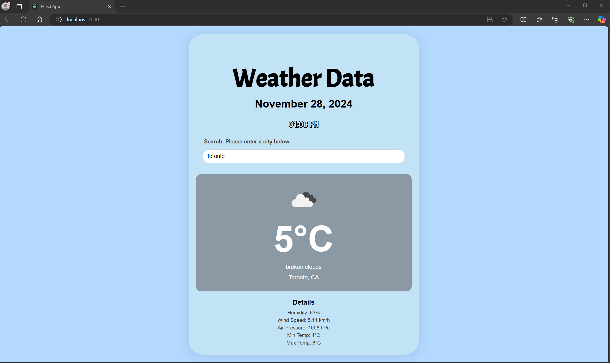
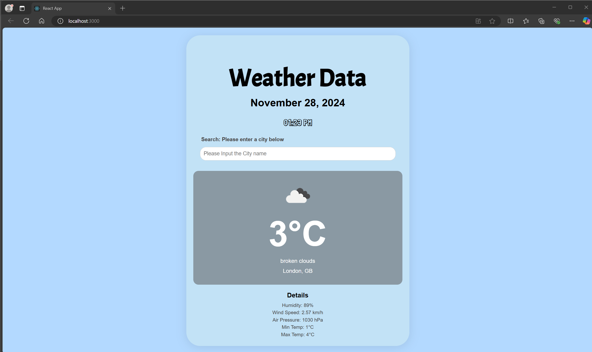
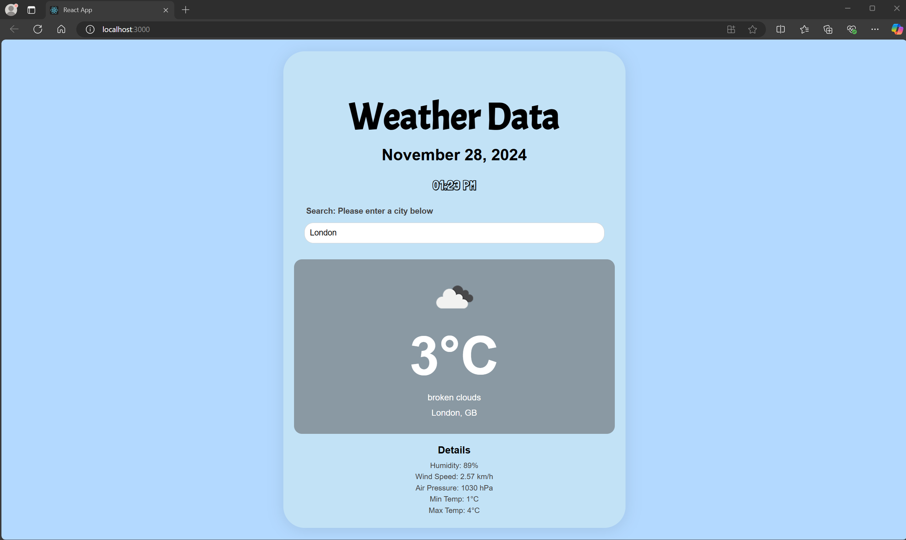
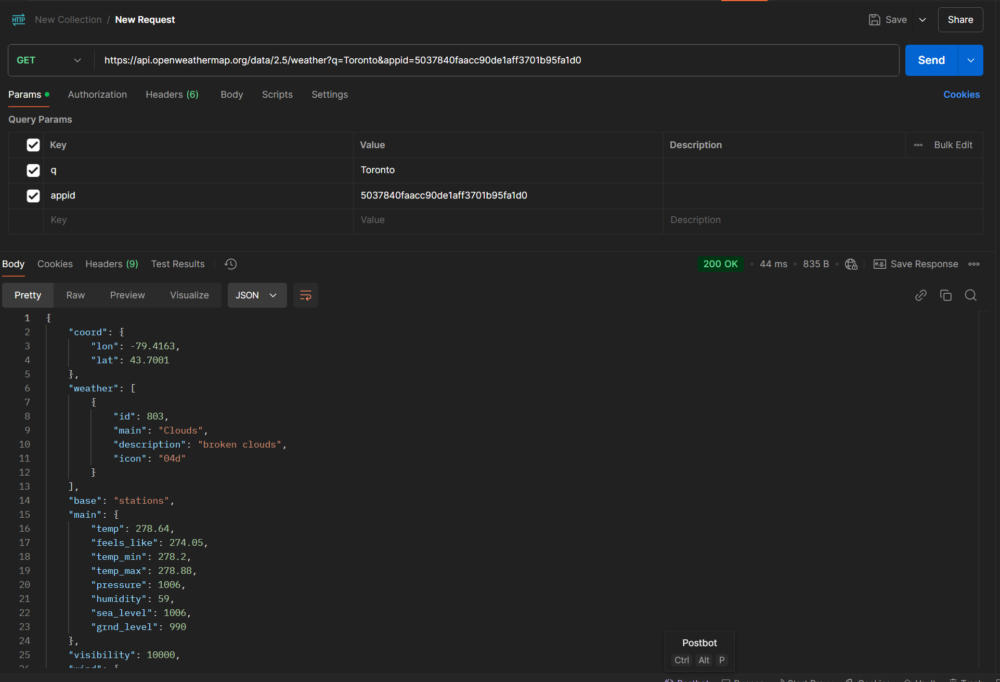

# Lab Test 2

### This lab test was compleated by:
####  Name: Jaskiran Gill
#### Student ID: 101458336

## ScreenShots
###### All images located in the assets folder
### Weather Data Page with Default (Toronto) Input

##### ________________________________________________________________________
### Weather Data Page Displaying Input search Field with No Input

##### ________________________________________________________________________
### Weather Data Page Displaying London Search Results

##### ________________________________________________________________________
### Postman Test

## Details
#### - Throughout the code i have incorperated comments to make reading the code easier. 
#### - As per the LabTest Requirements I have used API integration using the API Key i retrieved from openweathermap.org and applied useState and useEffect
#### - For the UI/UX design I applied various fonts retrieved from Google fonts (implementation is in the pulblic/index.html file and the app.css file)
#### - Created a dynamic search page the updates based on the search input (shown in the screenshots Toronto and London)
#### - Also incorporated the Displaying Data requirements as the application displays multiple weather conditions under the details heading 

## How to Run Application

In the project directory, you can run:

### `npm start`

Runs the app in the development mode.\
Open [http://localhost:3000](http://localhost:3000) to view it in your browser.

